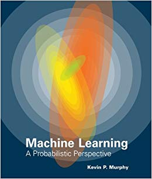

## TEST 3

Ejercicio 8.1 del libro: [A Probabilistic Perspective de Kevin Murphy](https://doc.lagout.org/science/Artificial%20Intelligence/Machine%20learning/Machine%20Learning_%20A%20Probabilistic%20Perspective%20%5BMurphy%202012-08-24%5D.pdf)

Puedes comprar el libro [aqui](https://www.amazon.es/Machine-Learning-Probabilistic-Perspective-Computation/dp/0262018020)

